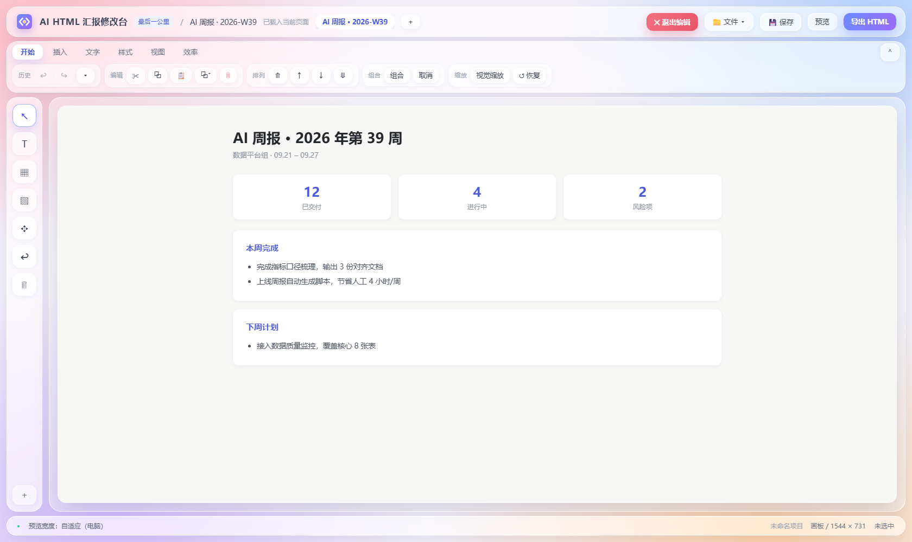

# AI HTML 汇报修改台

> **AI 生成 HTML 的最后一公里** · 生成之后，交稿之前



AI 生成的 HTML 汇报、周报、看板、落地页，总有"差一点点"的地方：文案有错字、数字没更新、图片比例不对、间距不齐、配色不统一。

为了这几个小瑕疵回头改提示词重跑，代价太高；直接读代码改，门槛又太高。

**AI HTML 汇报修改台** 就做这一件事：把生成好的 HTML 拖进来（或点一下浏览器插件图标），**像做 PPT 一样**改文字、换图片、调排版，然后导出一份干净的 HTML。

---

## 两种用法

| 方式 | 适合 | 入口 |
|---|---|---|
| **浏览器插件** | 已经在浏览器里打开着的网页 / 本地 HTML 文件 | 点工具栏图标，整屏进入修改台，改完导出 |
| **单文件版** | 手边的 HTML 文件；不想装插件 | 双击 `html-editor.html`，把文件拖进去 |

两种方式共用同一套编辑器内核：插件版由单文件版**自动生成**（见下方「开发」）。

## 安装插件（Chrome / Edge）

1. 打开 `chrome://extensions`（Edge：`edge://extensions`）
2. 打开右上角 **开发者模式**
3. 点 **加载已解压的扩展程序**，选择本仓库的 `html-editor-extension` 文件夹
4. 点右上角拼图图标 → 把本扩展 **📌 固定**到工具栏
5. 打开任意网页，点工具栏图标即可进入修改台（快捷键 `Alt+Shift+E`）
6. 要编辑**本地 HTML 文件**（`file:///…`）：进扩展详情页打开 **「允许访问文件网址」**

> 页面不允许注入时（新标签页、扩展商店、PDF 等），会自动新开一个标签页进入修改台，不会"点了没反应"。

## 使用

- **选中**：单击选中；`Shift` / `Ctrl` 点选多选；空白处拖框选；`Ctrl+A` 全选
- **调整**：拖动移动（自动吸附其他元素边界）、拉角缩放、顶部圆点旋转、方向键微调
- **改字**：双击就地编辑
- **对齐**：`Alt`+单击设对齐基准；功能区「样式」页签里左/中/右、顶端/垂直居中/底端、等距分布
- **组合**：`Ctrl+G` 组合，整组一个选框、整体缩放，双击进组编辑
- **保存**：`Ctrl+S` 存到本地项目（不下载文件）；「导出 HTML」才下载成品
- **撤销**：`Ctrl+Z` / `Ctrl+Y`，右上角 `▾` 可查看**撤销历史**并一次退回多步
- **退出**：点头部 `✕ 退出编辑` 回到原页面（原页面不被改动）

## 功能一览

| 模块 | 能力 |
|---|---|
| 文件 | 新建空白/骨架、**8 套模板**（周报、简历、定价页、邀请函…）、打开、保存到本地项目、导出 HTML、导出为…、最近文件、历史版本、页面标题与描述 |
| 项目 | **多页面管理**（标签切换/改名/复制/删除）、导出全部页面（含 index.html 导航页） |
| 编辑 | 撤销重做（80 步 + 步骤历史）、剪切复制粘贴、查找替换、自动保存与崩溃恢复 |
| 插入 | 文本、图片（本地文件自动内嵌）、8 种形状、9 种内容块、音视频、嵌入网页、自定义区块库 |
| 文本 | 字体、字号、B/I/U、颜色、段落对齐、**行高、字间距** |
| 元素样式 | 宽高、内外边距（四向）、边框（宽度/线型/颜色）、圆角、阴影、透明度、背景图 |
| 布局 | 拖拽绘制、**移动与缩放都自动吸附**、轴锁定（`Shift`）、对齐分布、组合、层级、格式刷 |
| 缩放 | **视觉缩放 / 真实尺寸自动判断**（文档流元素缩放不挤动别人）、`↺ 恢复`原始状态 |
| 图层 | 结构树、重命名、锁定、隐藏、拖拽调序 |
| 画布 | 缩放、标尺与辅助线、尺寸提示 |
| 图片 | 填充方式、内部位置（`Alt` 拖动）、锁定比例、压缩、替代文字、丢失检查 |
| 表格 | 行列增删、合并/拆分、表头行、统一边框 |
| 分栏 | flex/grid 切换、分栏数、间距、分布、**自动换行** |
| 链接交互 | 链接 / 锚点 / 新窗口、**悬停样式**（导出后仍生效） |
| 多端 | 电脑 / 平板 / 手机预览、元素**分端隐藏** |
| 主题 | 一键统计高频色全页替换 + 统一字体 |
| 代码 | HTML / CSS 双视图编辑、语法检查、定位选中元素源码 |
| 导出检查 | 图片失效、外链、缺 alt、内容溢出、脚本保真提示、资源打包 |

## 上架浏览器商店

| 需要的 | 位置 |
|---|---|
| 商店包（manifest 在 ZIP 根目录，可直接上传） | `store/ai-html-report-editor-v1.0.0.zip` |
| 图标 / 促销图 / 截图 | `store/`（300×300、440×280、1400×560、1280×800×3） |
| **逐字段可复制文案**（单一用途、权限说明、数据使用、详细描述、搜索词、审核备注） | [`docs/EDGE-上架指南.md`](docs/EDGE-上架指南.md) |
| 隐私政策 | [`PRIVACY.md`](PRIVACY.md) |

重新生成素材与商店包：

```bash
node html-editor-extension/tools/make-store-assets.js
node html-editor-extension/tools/pack-store.js     # 打包 + 自检（根目录/名称长度/图标/外置脚本）
```

## 项目结构

```
.
├── html-editor.html              ← 单文件版（唯一源文件）
├── html-editor-extension/        ← 浏览器插件
│   ├── manifest.json             MV3 清单
│   ├── background.js             点击图标 → 注入；注入失败则新开修改台
│   ├── content.js                整屏遮罩 + 载入修改台，把当前页面交给它
│   ├── editor/                   由单文件版生成的 editor.html + css + js
│   ├── icons/                    16 / 32 / 48 / 128 图标
│   └── tools/                    构建、图标、截图、同步打包脚本
├── brand/                        品牌资产：LOGO（SVG/PNG）、命名与配色
├── docs/                         截图
├── versions/                     版本归档与更新记录
├── 同步打包.cmd                   一键同步（双击即用）
└── LICENSE
```

## 开发

改完 `html-editor.html` 后，在根目录双击 **`同步打包.cmd`**，或执行：

```bash
node html-editor-extension/tools/sync-all.js
```

它会一次完成：**生成**插件版 `editor/` 三件套 → **归档**单文件版 → **打包** zip → **校验一致性**（逐项 ✅/❌）。

> 为什么插件里的编辑器必须拆成三个文件？Chrome 扩展页（MV3）的默认 CSP 是 `script-src 'self'`，**禁止内联 `<script>`**；内联版本会表现为「界面能打开，但所有按钮都没反应」。

其他脚本：

```bash
node html-editor-extension/tools/make-icons.js       # 重新生成插件图标
node html-editor-extension/tools/make-screenshot.js  # 重新生成 README 截图
```

## 许可

[MIT](LICENSE)
